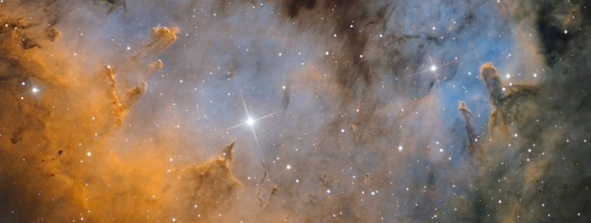

# DeepSpace is a Artificial Intellegence Framework


[]()

## DeepSpace training framework #

---

Implement your projects the smart way.

A **Scalable farmework** for PyTorch projects, with examples in Image Segmentation, Object detection & classification, GANs and Reinforcement Learning.

Given the nature of deep learning projects, we do not get the chance to think much about the project structure or the code modularity. After working with different deep learning projects and facing problems with files organization and code repetition, we came up with a **modular project structure** to accommodate any PyTorch project.

If you are working on x-ray, you may also want to check out a smart xray project:  
[dXray on github](https://github.com/magicknight/dxray) 

or 

[dXray on gitlab](https://gitlab.com/Visionlab-ASTRA/dxray)

### Table of Contents: 
- [PyTorch Project Template](#pytorch-project-template)
    - [Why this template?](#why-this-template)
    - [Tutorials](#tutorials)
    - [Contribution](#contribution)
    - [Template Class Diagram](#template-class-diagram)
    - [Referenced Repos](#referenced-repos)
    - [Repos Migration Summary](#repos-migration-summary)
    - [Template Repo Structure](#repo-structure)
    - [Requirements](#requirements)
    - [Future Work](#future-work)
    - [License](#license)
    
### Why this template?

**A baseline** for any PyTorch project to give you a quick start, where you will get the time to focus on your model's implementation and this framework will handle the rest. The novelty of this approach lies in:
- Providing **a scalable project structure**, with a template file for each.
- Introducing the usage of a config file that handle all the hyper-parameters related to a certain problem.
- Embedding examples from various problems inside the template, where you can run any of them independently with a **single change** in the config file name.
- **Tutorials** to get you started.

### Tutorials:
This framework is providing a series of tutorials to get your started

* [Getting Started Tutorial](tutorials/getStarted_tutorial.md): where we provide a guide on the main steps to get started on your project.
* [Mnist Tutorial](tutorials/mnist_tutorial.md): Here we take an already implemented NN model on Mnist and adapt it to our template structure.

### Contribution:
* We are welcoming any contribution from the community that will make this come true so we urge people to add their PyTorch models into the template.
* We are also welcoming any proposed changes or discussions about the class design pattern used in this project.

### Template Class Diagram:


### Referenced Repos:
1. [ERFNet](https://github.com/hagerrady13/ERFNet-PyTorch): A model for **Semantic Segmentation**, trained on Pascal Voc
2. [DCGAN](https://github.com/hagerrady13/DCGAN-Pytorch): Deep Convolutional **Generative Adverserial Networks**, run on CelebA dataset.
3. [CondenseNet](https://github.com/hagerrady13/CondenseNet-Pytorch): A model for **Image Classification**, trained on Cifar10 dataset
4. [DQN](https://github.com/hagerrady13/DQN-Pytorch): Deep Q Network model, a **Reinforcement Learning** example, tested on CartPole-V0

### Repos Migration Summary:

1) We started by DCGAN, adding its custom configs into the json/toml file. DCGAN has both generator and discriminator model so it doesn't have a single model file.
2) Then, we added CondenseNet, where it was necessary to create a custom blocks folder inside the models folder to include the definitions for custom layers within the model.
3) After that, we added the DQN project, where all the classes related to the environment have been added to the utils. We also added the action selection and model optimization into the training agent.
4) ERFNet was the last example to join the template; agent, model and utils have been added to their folders with no conflicts.

This is to ensure that our proposed project structure is compatible with different problems and can handle all the variations related to any of them.

### Repo Structure:
the repo has the following structure:
```
|-- tutorials/
|-- test/
|   |-- ssim/
|-- configs/
|   |-- toml/
|   |-- json/
|-- data/
|   |-- wp8 -> /mnt/data/anomaly/wp8
|   |-- bunny -> /mnt/data/anomaly/simulation/bunny
|   |-- tsinghua -> /mnt/data/contest/tsinghua
|-- pretrained_weights/
|-- documents/
|   |-- assets/
|   |-- notebooks/
|-- experiments/
|   |-- defect/
|   |-- wp8/
|   |-- competition/
|-- deepspace/
|   |-- datasets/
|   |-- config/
|   |-- graphs/
|   |-- environments/
|   |-- utils/
|   |-- agents/
|   |-- __pycache__/
```

### Requirements:
```
scikit_image==0.17.2
scipy==1.5.3
easydict==1.9
tqdm==4.53.0
numpy==1.17.4
trimesh==3.9.1
torchvision==0.9.0
matplotlib==3.1.3
pytorch_msssim==0.2.1
dxray==0.1
imageio==2.9.0
gym==0.18.0
deepdish==0.3.6
torch==1.8.0
seaborn==0.11.0
opencv_python==4.5.1.48
Pillow==8.2.0
scikit_learn==0.24.1
skimage==0.0
tensorboardX==2.1
```

### Future Work:

We are planning to add project examples into our template to include various categories of problems. 

### License:
TBD
